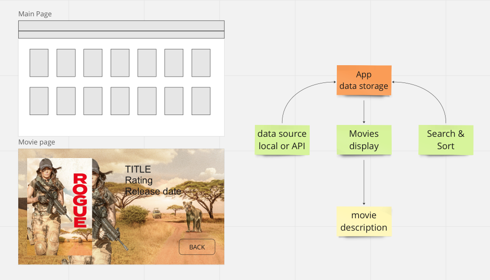
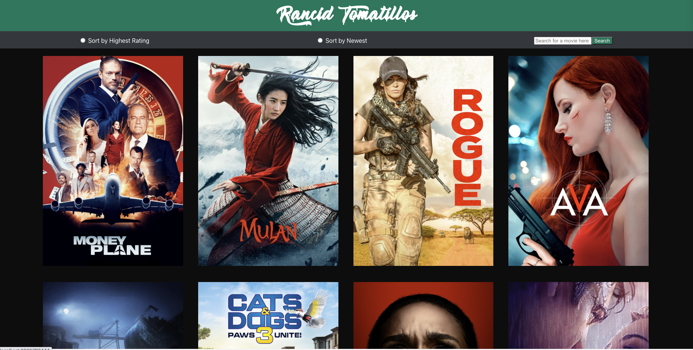
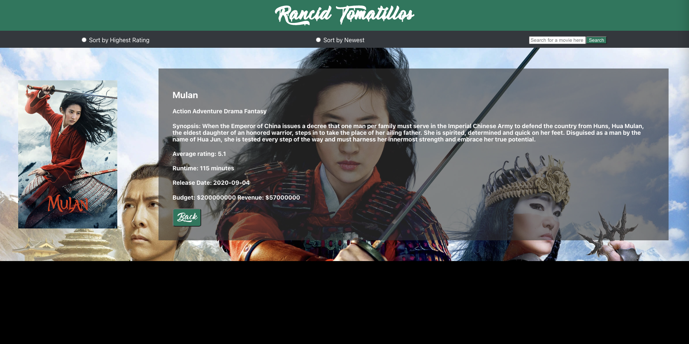
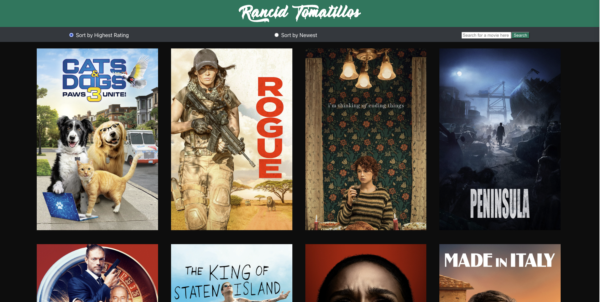
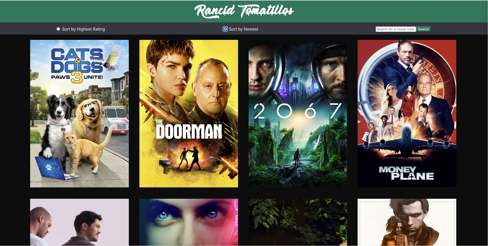

# Rancid Tomatillos
## Team project by Andrew K and Catalyst

## Table of Contents
- [Our Project](#our-project)
- [Technologies](#technologies)
- [Screenshots](#screenshots)
- [Access Website](#access-website)
- [Reflections](#reflections)

### Our project 
Rancid Tomatillos is a paired project from module 3 of Turing School of Software & Design. It is a simple web app that displays movie information. The user is able to view a grid of movie posters and click on one to see more information about that movie. One can also sort the movies by select criteria and search for a movie by name.

- [The spec and rubric can be found here](https://frontend.turing.edu/projects/module-3/rancid-tomatillos-v3.html). 
- [The deployed link can be accessed here](https://rottentomatillos.vercel.app). 
- [GitHub link can be found here](https://github.com/Universal-Patois/rottenTomatillos).

#### Project Board 

As our first foray into using React, the coding process started out surprisingly smooth. We were able to get our basic components working without much fuss. Likewise, fetching and displaying API information worked quite well. We ran into trouble as we attempted to implement more functions and features. Likewise using Cypress testing was daunting at first, but once we understood how it worked, we were able to write many accurate tests.

## Technologies:
- REACT
- ROUTER
- TDD WITH CYPRESS
- JAVASCRIPT
- CSS
- HTML
- WEBPACK
- Deployed with VERCEL

## Screenshots

### Home Page

### Movie Description Page

### Movies Sorted By Rating

### Movies Sorted By Date

## Access Website
- When the user visits the application [here](https://rottentomatillos.vercel.app), they will be able to see a page populated with movie posters. If they click a poster they will be able to see the details for that specific movie. They can then return to the home page by clicking the "Back" button on that page or in the internet browser.

- Each page has a unique URL that can be bookmarked or manually typed in the address bar.

- When a user selects the "Sort by Highest Rating" button they will be shown a display of all the movies, sorted from their ratings highest - lowest.

- When a user selects the "Sort by Newest" button they will be shown a display of all the movies, sorted by the newest.

- A user is able to search for a movie in the search bar. When the user clicks the search button, and their spelling is correct, they will be taken to the details page for that specific movie.

## Reflections

When attempting to add a feature to sort the movies by their genre we encountered an issue with being able to access each movies genre information. 

When all of the movies are fetched from our API they do not return with a property that contains their genre. But, if a single movie is fetched it will contain that information. In order to sort all of the movies by genre we had thought the only possible way was to fetch information for each movie and then sort.

Ultimately we decided against this functionality and instead went with sorting by rating and release date. We chose this because we thought the code needed to sort by genre would be too slow/inefficient based on the way the API was returning the information.
